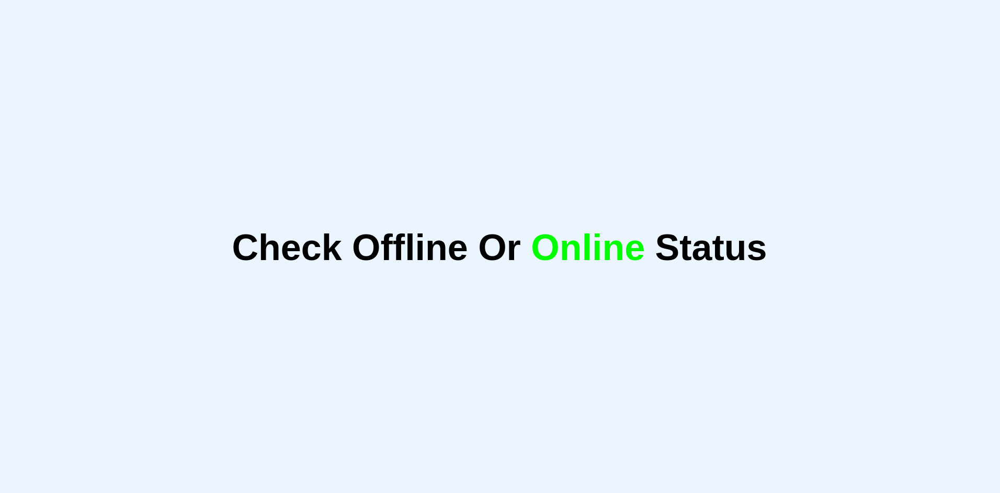
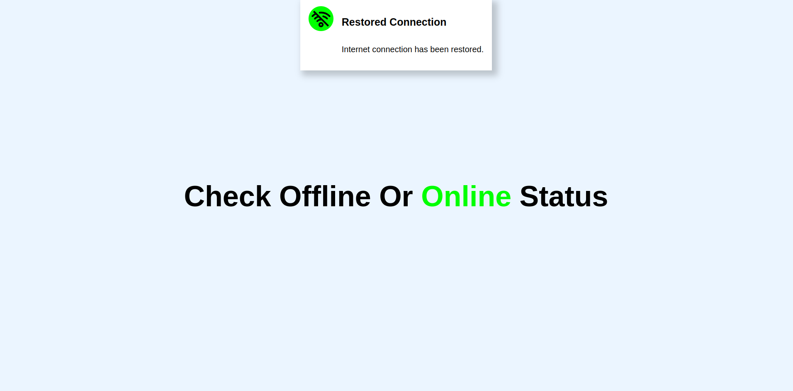
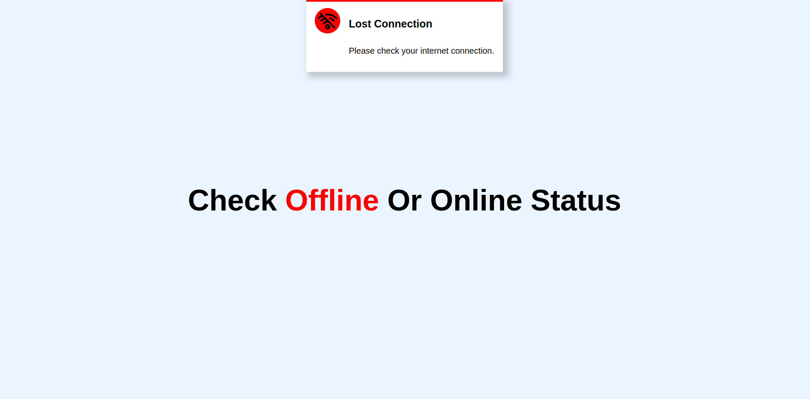

<h1>Check_Offline_or_Online_Status_v1.0</h1>
<h2>This application to send a pop-up window if the Internet connection is interrupted.</h2>
<h3>programming languages: HTML, CSS, JS.</h3>
<h4>Live Demo: https://mohamed-0-turki.github.io/Check_Offline_or_Online_Status_v1.0/</h4>
<h4>The API was used from the https://jsonplaceholder.typicode.com/</h4>
<h5>! NOTE: This is a free fake API.</h5>
<h6>Online Status Without Popup</h6>

<h6>Online Status With Popup</h6>

<h6>Offline Status With Popup</h6>

